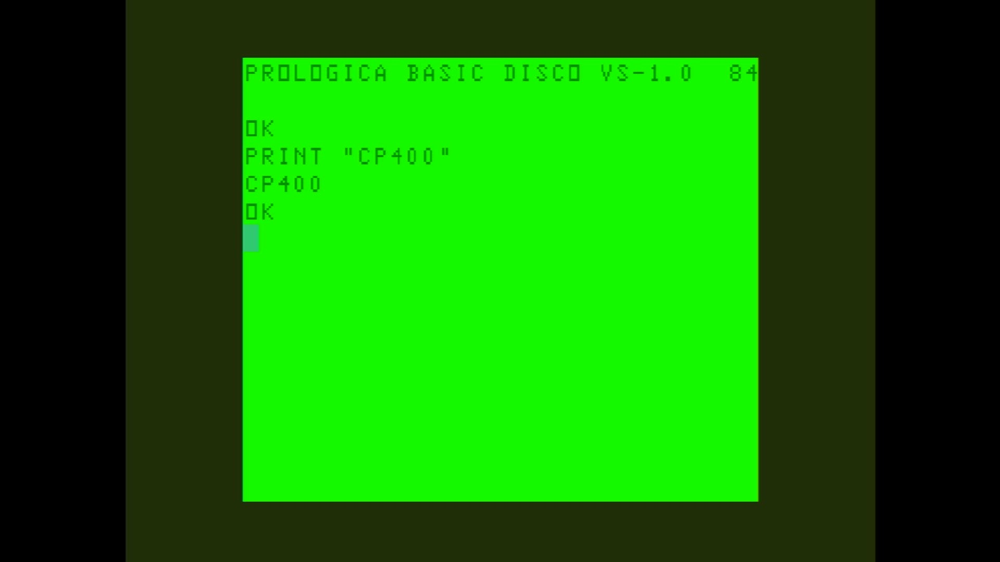

# CP400

- **`make kernel MACHINE=cp400`** — TRS / Tandy
- **Year**: 1983
- **Manufacturer**: Prológica

## At power-on

`CP400` at power-on on the real board — see the capture above.

## Required assets

- `roms/cp400.zip`

  | ROM | CRC32 |
  |---|---|
  | `cp400bas.rom` | `878396a5` |
- `roms/cp450_fdc.zip`

## Notes

- MAME driver: `coco12.cpp`.
- MAME clone of `coco` (Color Computer 1/2) — the system macro's parent field in the driver source. The ROM table above lists every member this machine's own zip needs.

[← back to TRS / Tandy](README.md)
