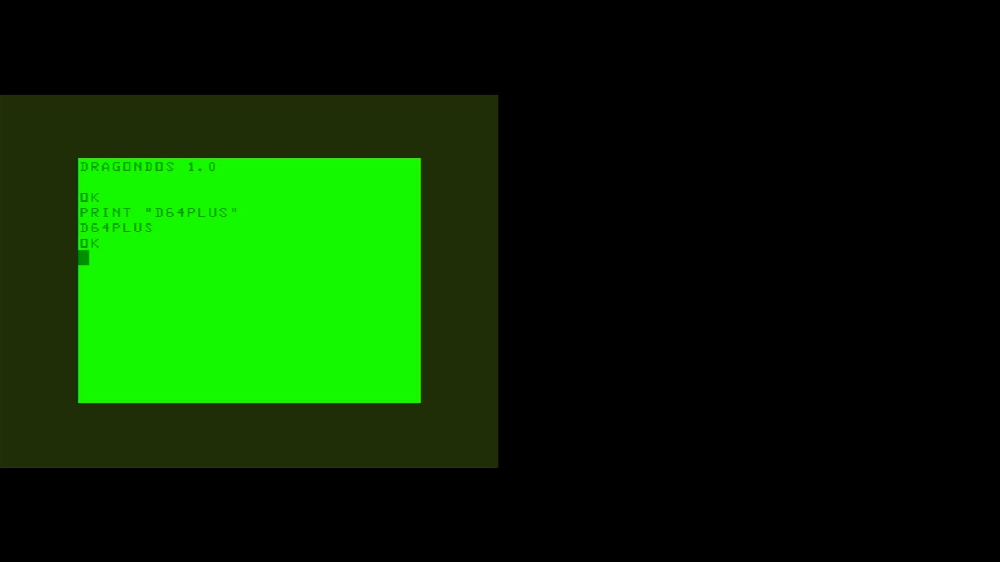

# Dragon 64 Plus

- **`make kernel MACHINE=d64plus`** — TRS / Tandy
- **Year**: 1985
- **Manufacturer**: Dragon Data Ltd / Compusense

## At power-on

`Dragon 64 Plus` at power-on on the real board — see the capture above.

## Required assets

- `roms/d64plus.zip`

  | ROM | CRC32 |
  |---|---|
  | `d64_1.rom` | `60a4634c` |
  | `d64_2.rom` | `17893a42` |
  | `n82s147an.ic12` | `92b6728d` |
  | `chargen.ic22` | `514f1450` |
- `roms/dragon_fdc.zip`

## Notes

- MAME driver: `dragon.cpp`.
- MAME clone of `dragon32` (Dragon 32) — the system macro's parent field in the driver source. The ROM table above lists every member this machine's own zip needs.

[← back to TRS / Tandy](README.md)
