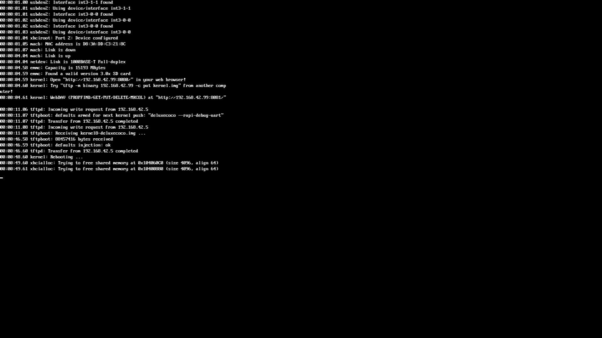

# Deluxe Color Computer

- **`make kernel MACHINE=deluxecoco`** — TRS / Tandy
- **Year**: 1983
- **Manufacturer**: Tandy Radio Shack

## At power-on

**PARKED** — hangs after MAME's own startup log (framebuffer init completes) with no fatal error, no "sdl2: pump alive" heartbeat, and no pump-stall deadman dump — total serial silence, confirmed reproducible across two independent boots. No MACHINE_NOT_WORKING flag on this driver; presumption is this port's world, not upstream emulation. Robot-hands input never registered (nothing was listening either time). Diagnosis, not fix, is this parcel's job — unblock is a future ruling. The capture above shows the observed stop; the machine is not offered until the park is lifted by a policy ruling.

## Required assets

- `roms/deluxecoco.zip`

  | ROM | CRC32 |
  |---|---|
  | `adv070_u24.rom` | `827fe698` |
  | `adv071_u24.rom` | `0a3942e4` |
  | `adv072_u24.rom` | `c0118da5` |
  | `adv073-2_u24.rom` | `61411227` |
- `roms/coco_fdc.zip`

## Notes

- MAME driver: `coco12.cpp`.
- MAME clone of `coco` (Color Computer 1/2) — the system macro's parent field in the driver source. The ROM table above lists every member this machine's own zip needs.

[← back to TRS / Tandy](README.md)
