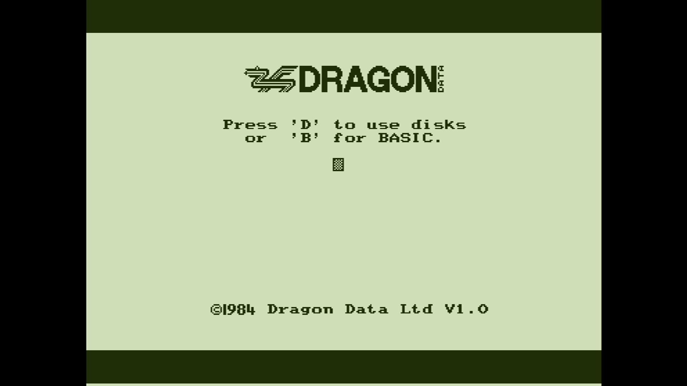

# Dragon Professional (Alpha)

- **`make kernel MACHINE=dgnalpha`** — TRS / Tandy
- **Year**: 1984
- **Manufacturer**: Dragon Data Ltd

## At power-on

`Dragon Professional (Alpha)` at power-on on the real board — see the capture above.

## Required assets

- `roms/dgnalpha.zip`

  | ROM | CRC32 |
  |---|---|
  | `alpha_bt_10.rom` | `c3dab585` |
  | `alpha_bt_04.rom` | `d6172b56` |
  | `alpha_ba.rom` | `84f68bf9` |

## Notes

- MAME driver: `dgnalpha.cpp`.
- MAME clone of `dragon32` (Dragon 32) — the system macro's parent field in the driver source. The ROM table above lists every member this machine's own zip needs.

[← back to TRS / Tandy](README.md)
