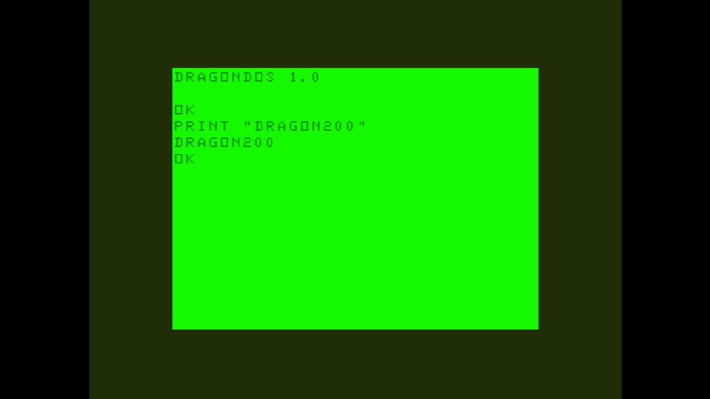

# Dragon 200

- **`make kernel MACHINE=dragon200`** — TRS / Tandy
- **Year**: 1985
- **Manufacturer**: Eurohard S.A.

## At power-on

`Dragon 200` at power-on on the real board — see the capture above.

## Required assets

- `roms/dragon200.zip`

  | ROM | CRC32 |
  |---|---|
  | `ic18.rom` | `84f68bf9` |
  | `ic17.rom` | `17893a42` |
- `roms/dragon_fdc.zip`

## Notes

- MAME driver: `dragon.cpp`.
- MAME clone of `dragon32` (Dragon 32) — the system macro's parent field in the driver source. The ROM table above lists every member this machine's own zip needs.

[← back to TRS / Tandy](README.md)
