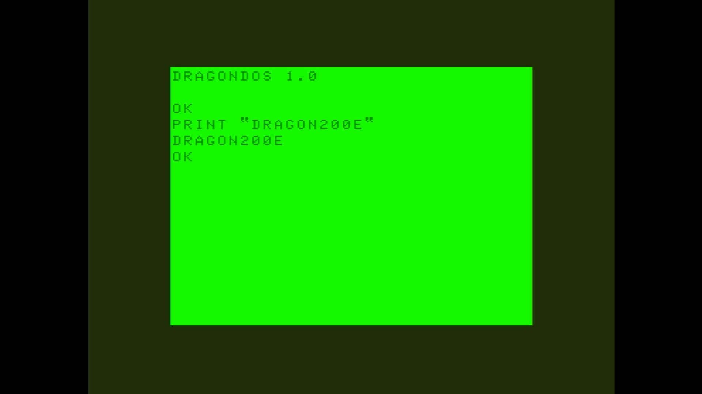

# Dragon 200-E

- **`make kernel MACHINE=dragon200e`** — TRS / Tandy
- **Year**: 1985
- **Manufacturer**: Eurohard S.A.

## At power-on

`Dragon 200-E` at power-on on the real board — see the capture above.

## Required assets

- `roms/dragon200e.zip`

  | ROM | CRC32 |
  |---|---|
  | `ic18_v1.4e.ic34` | `95af0a0a` |
  | `ic17_v1.4e.ic37` | `48b985df` |
  | `rom26.ic1` | `565724bc` |
- `roms/dragon_fdc.zip`

## Notes

- MAME driver: `dragon.cpp`.
- MAME clone of `dragon32` (Dragon 32) — the system macro's parent field in the driver source. The ROM table above lists every member this machine's own zip needs.

[← back to TRS / Tandy](README.md)
