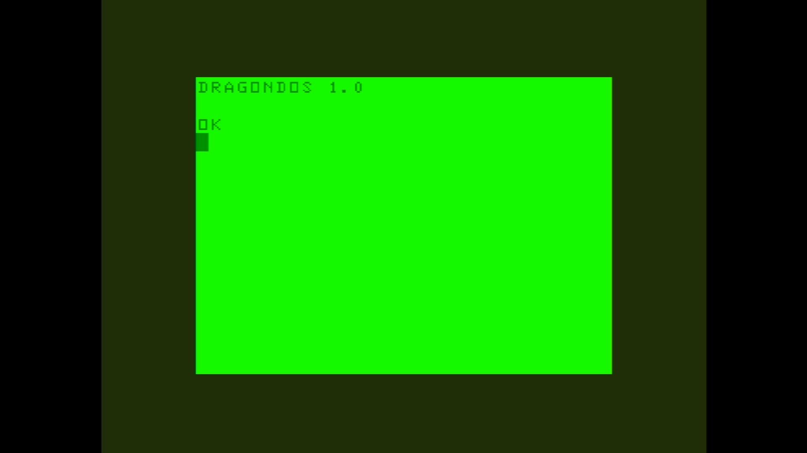

# Dragon 32

- **`make kernel MACHINE=dragon32`** — TRS / Tandy
- **Year**: 1982
- **Manufacturer**: Dragon Data Ltd

## At power-on

`Dragon 32` at power-on on the real board — see the capture above.

## Required assets

- `roms/dragon32.zip`

  | ROM | CRC32 |
  |---|---|
  | `dragon_data_ltd_1-0.ic18` | `e192b3eb` |
  | `dragon_data_ltd_1-1.ic17` | `0e1d7bf0` |
- `roms/dragon_fdc.zip`

## Notes

- MAME driver: `dragon.cpp`.

[← back to TRS / Tandy](README.md)
