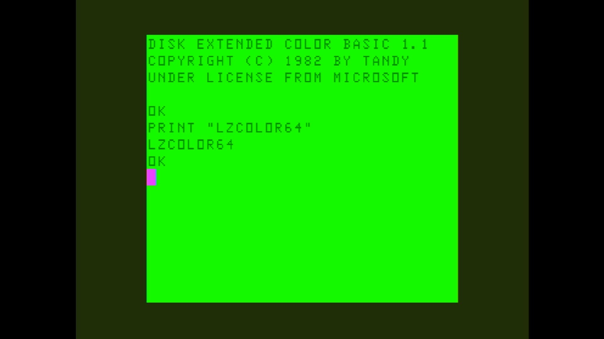

# Color64

- **`make kernel MACHINE=lzcolor64`** — TRS / Tandy
- **Year**: 1983
- **Manufacturer**: Novo Tempo / LZ Equipamentos

## At power-on

`Color64` at power-on on the real board — see the capture above.

## Required assets

- `roms/lzcolor64.zip`

  | ROM | CRC32 |
  |---|---|
  | `color_basic.ci24` | `b0717d71` |
  | `extendido.ci23` | `d1b1560d` |
- `roms/coco_fdc.zip`

## Notes

- MAME driver: `coco12.cpp`.
- MAME clone of `coco` (Color Computer 1/2) — the system macro's parent field in the driver source. The ROM table above lists every member this machine's own zip needs.

[← back to TRS / Tandy](README.md)
