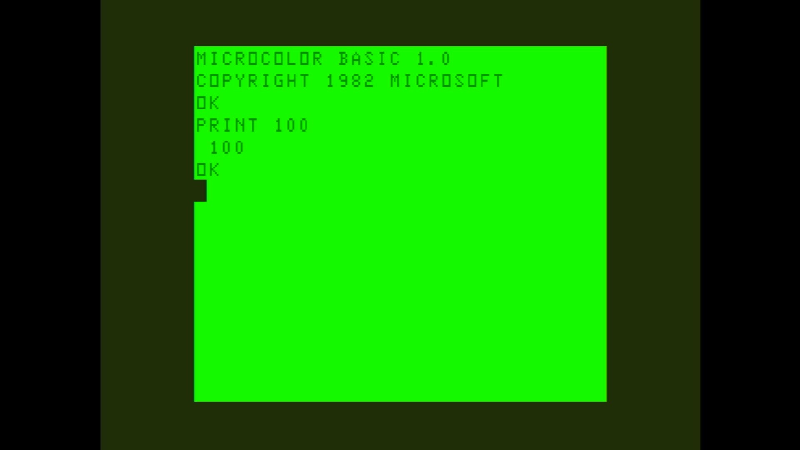

# MC-10

- **`make kernel MACHINE=mc10`** — TRS / Tandy
- **Year**: 1983
- **Manufacturer**: Tandy Radio Shack

## At power-on

`MC-10` at power-on on the real board — see the capture above.

## Required assets

- `roms/mc10.zip`

  | ROM | CRC32 |
  |---|---|
  | `mc10.rom` | `11fda97e` |

## Notes

- MAME driver: `mc10.cpp`.

[← back to TRS / Tandy](README.md)
