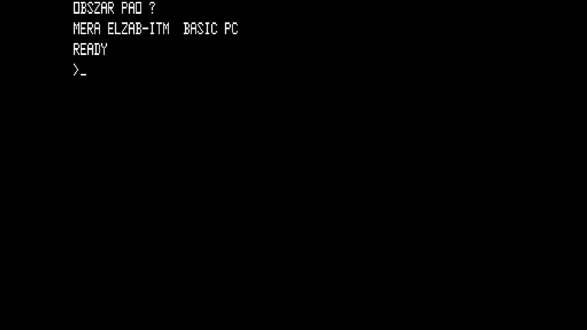

# Meritum I (Model 1)

- **`make kernel MACHINE=meritum1`** — TRS / Tandy
- **Year**: 1983
- **Manufacturer**: Mera-Elzab

## At power-on

`Meritum I (Model 1)` at power-on on the real board — see the capture above.

## Required assets

- `roms/meritum1.zip`

  | ROM | CRC32 |
  |---|---|
  | `rom_0.ic7` | `1ecf7205` |
  | `rom_1.ic8` | `ac297d99` |
  | `rom_2.ic9` | `a21d0d62` |
  | `rom_3.ic10` | `3a5ea239` |
  | `rom_4.ic11` | `2ba025d7` |
  | `rom_5.ic12` | `ed547445` |
  | `rom_6.ic13` | `650c0f47` |
  | `char_gen.ic72` | `626fb8b1` |

## Notes

- MAME driver: `meritum.cpp`.

[← back to TRS / Tandy](README.md)
