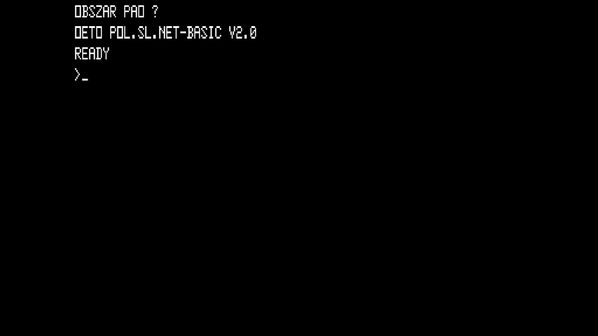

# Meritum I (Model 2) (network)

- **`make kernel MACHINE=meritum_net`** — TRS / Tandy
- **Year**: 1985
- **Manufacturer**: Mera-Elzab

## At power-on

`Meritum I (Model 2) (network)` at power-on on the real board — see the capture above.

## Required assets

- `roms/meritum_net.zip`

  | ROM | CRC32 |
  |---|---|
  | `01_447_m07_015m.ic7` | `6d30cb49` |
  | `02_440_m08_01.ic8` | `ac297d99` |
  | `03_440_m09_015m.ic9` | `88e267da` |
  | `04_447_m10_015m.ic10` | `e51991e4` |
  | `05_440_m11_02.ic11` | `461fbf0d` |
  | `06_440_m12_01.ic12` | `ed547445` |
  | `07_447_m13_015m.ic13` | `789f6964` |
  | `char.ic72` | `2c09a5a7` |

## Notes

- MAME driver: `meritum.cpp`.
- MAME clone of `meritum1` (Meritum I (Model 1)) — the system macro's parent field in the driver source. The ROM table above lists every member this machine's own zip needs.

[← back to TRS / Tandy](README.md)
