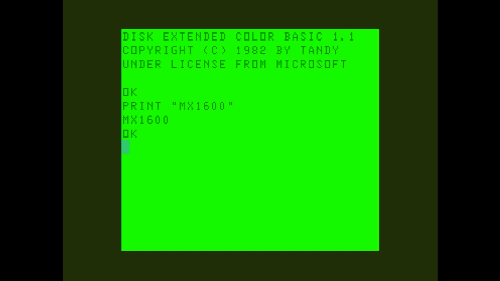

# MX-1600

- **`make kernel MACHINE=mx1600`** — TRS / Tandy
- **Year**: 1984
- **Manufacturer**: Dynacom

## At power-on

`MX-1600` at power-on on the real board — see the capture above.

## Required assets

- `roms/mx1600.zip`

  | ROM | CRC32 |
  |---|---|
  | `mx1600bas.rom` | `d918156e` |
  | `mx1600extbas.rom` | `322a3d58` |
- `roms/coco_fdc.zip`

## Notes

- MAME driver: `coco12.cpp`.
- MAME clone of `coco` (Color Computer 1/2) — the system macro's parent field in the driver source. The ROM table above lists every member this machine's own zip needs.

[← back to TRS / Tandy](README.md)
