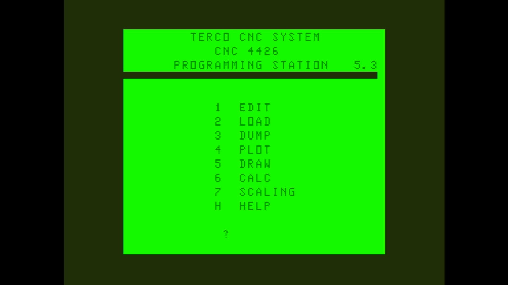

# Terco 4426 CNC Programming station

- **`make kernel MACHINE=t4426`** — TRS / Tandy
- **Year**: 1986
- **Manufacturer**: Terco AB

## At power-on

`Terco 4426 CNC Programming station` at power-on on the real board — see the capture above.

## Required assets

- `roms/t4426.zip`

  | ROM | CRC32 |
  |---|---|
  | `soft4426-u13-1.2.bin` | `3c1af94a` |
  | `soft4426-u14-1.2.bin` | `e031d076` |
- `roms/coco_t4426.zip`

## Notes

- MAME driver: `coco12.cpp`.
- MAME clone of `coco` (Color Computer 1/2) — the system macro's parent field in the driver source. The ROM table above lists every member this machine's own zip needs.

[← back to TRS / Tandy](README.md)
