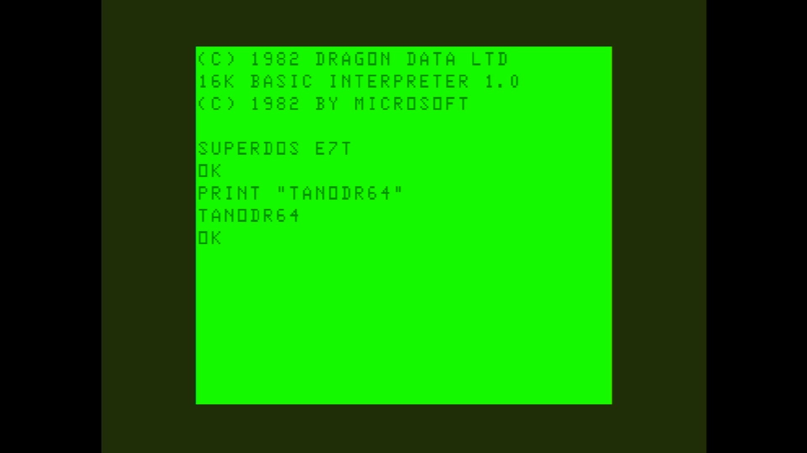

# Tano Dragon 64 (NTSC)

- **`make kernel MACHINE=tanodr64`** — TRS / Tandy
- **Year**: 1983
- **Manufacturer**: Dragon Data Ltd / Tano Ltd

## At power-on

`Tano Dragon 64 (NTSC)` at power-on on the real board — see the capture above.

## Required assets

- `roms/tanodr64.zip`

  | ROM | CRC32 |
  |---|---|
  | `tano_1.ic18` | `84f68bf9` |
  | `tano_2.ic17` | `17893a42` |
- `roms/sdtandy_fdc.zip`

## Notes

- MAME driver: `dragon.cpp`.
- MAME clone of `dragon32` (Dragon 32) — the system macro's parent field in the driver source. The ROM table above lists every member this machine's own zip needs.

[← back to TRS / Tandy](README.md)
