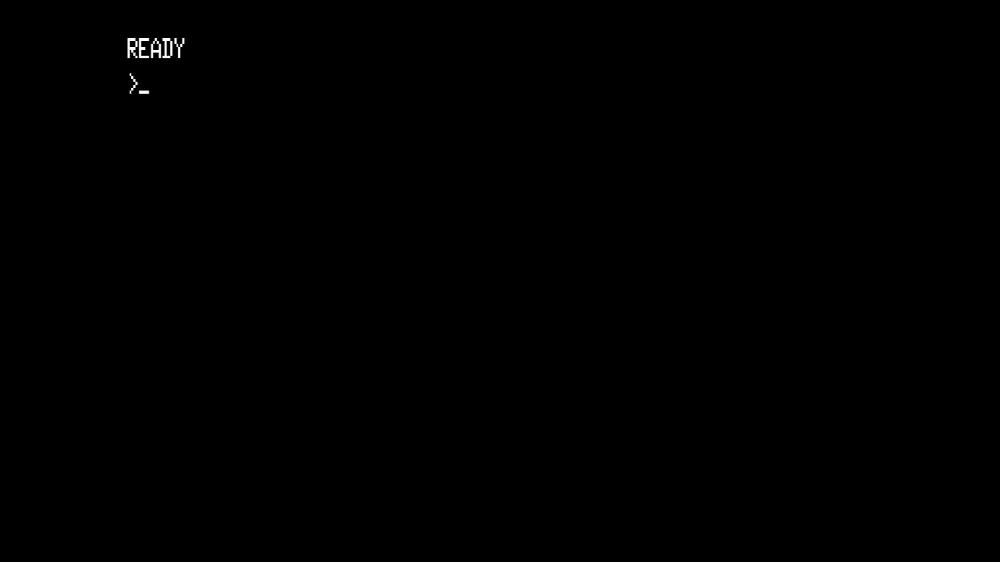

# TRS-80 Model I (Level I Basic)

- **`make kernel MACHINE=trs80`** — TRS / Tandy
- **Year**: 1977
- **Manufacturer**: Tandy Radio Shack

## At power-on

`TRS-80 Model I (Level I Basic)` at power-on on the real board — see the capture above.

## Required assets

- `roms/trs80.zip`

  | ROM | CRC32 |
  |---|---|
  | `level1.rom` | `70d06dff` |
  | `mcm6670p.z29` | `0033f2b9` |

## Notes

- MAME driver: `trs80.cpp`.

[← back to TRS / Tandy](README.md)
