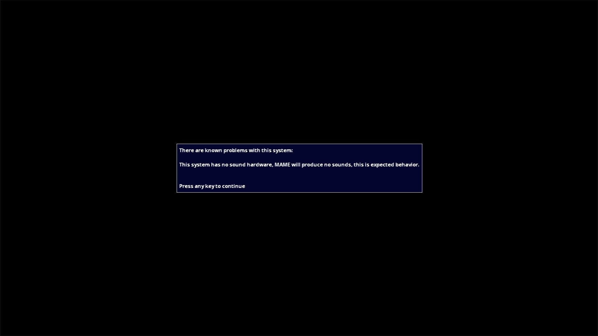

# Videotex

- **`make kernel MACHINE=trsvidtx`** — TRS / Tandy
- **Year**: 1980
- **Manufacturer**: Tandy Radio Shack

## At power-on

**PARKED** — same box class as agvision — MACHINE_NO_SOUND_HW, box held across two grabs 15s apart. The capture above shows the observed stop; the machine is not offered until the park is lifted by a policy ruling.

## Required assets

- `roms/trsvidtx.zip`

  | ROM | CRC32 |
  |---|---|
  | `8041716-1.1-videotex.u13` | `821a59bb` |

## Notes

- MAME driver: `agvision.cpp`.

[← back to TRS / Tandy](README.md)
