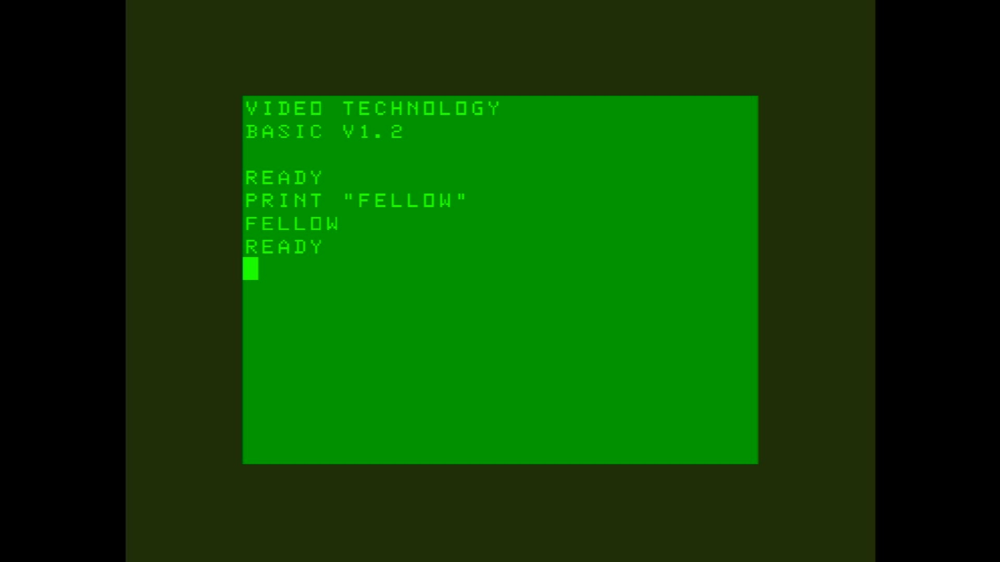

# Fellow (Finland)

- **`make kernel MACHINE=fellow`** — VTech
- **Year**: 1983
- **Manufacturer**: Salora

## At power-on

`Fellow (Finland)` at power-on on the real board — see the capture above.

## Required assets

- `roms/fellow.zip`

  | ROM | CRC32 |
  |---|---|
  | `vtechv12.u09` | `99412d43` |
  | `vtechv12.u10` | `e4c24e8b` |

## Notes

- MAME driver: `vtech1.cpp`.
- MAME clone of `laser200` (Laser 200) — the system macro's parent field in the driver source. The ROM table above lists every member this machine's own zip needs.

[← back to VTech](README.md)
