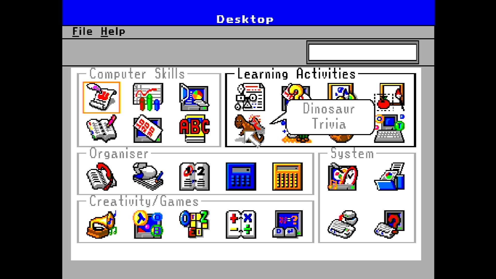

# VTech IT Unlimited (UK)

- **`make kernel MACHINE=itunlim`** — VTech
- **Year**: 1998
- **Manufacturer**: Video Technology

## At power-on

**PARKED** — stops at MAME's known-problems box (MACHINE_NO_SOUND, sound completely unemulated); box held across two grabs 15s apart. Robot-hands dismissal confirms the core boots to its own "Desktop" learning-suite GUI and takes input, forensic only — verdict is parked, not promoted. The capture above shows the observed stop; the machine is not offered until the park is lifted by a policy ruling.

## Required assets

- `roms/itunlim.zip`

  | ROM | CRC32 |
  |---|---|
  | `27-06124-002.u3` | `0c0753ce` |

## Notes

- MAME driver: `geniusiq.cpp`.
- MAME clone of `pcunlim` (PreComputer Unlimited (USA/Canada)) — the system macro's parent field in the driver source. The ROM table above lists every member this machine's own zip needs.

[← back to VTech](README.md)
