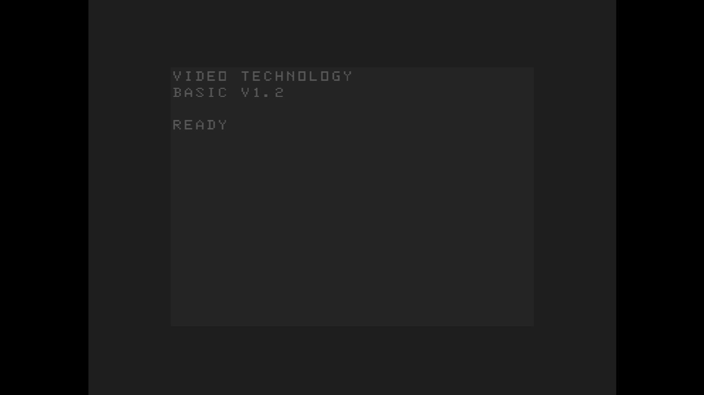

# Laser 110

- **`make kernel MACHINE=laser110`** — VTech
- **Year**: 1983
- **Manufacturer**: Video Technology

## At power-on

`Laser 110` at power-on on the real board — see the capture above.

## Required assets

- `roms/laser110.zip`

  | ROM | CRC32 |
  |---|---|
  | `vtechv12.u09` | `99412d43` |
  | `vtechv12.u10` | `e4c24e8b` |

## Notes

- MAME driver: `vtech1.cpp`.

[← back to VTech](README.md)
