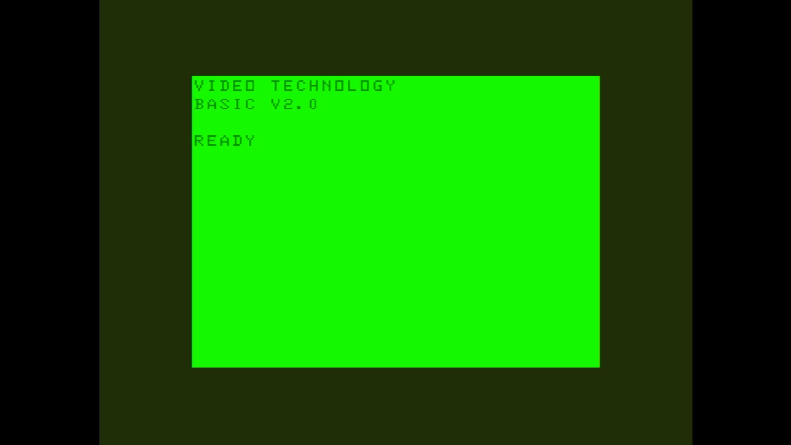

# Laser 310

- **`make kernel MACHINE=laser310`** — VTech
- **Year**: 1984
- **Manufacturer**: Video Technology

## At power-on

`Laser 310` at power-on on the real board — see the capture above.

## Required assets

- `roms/laser310.zip`

  | ROM | CRC32 |
  |---|---|
  | `vtechv20.u12` | `613de12c` |
  | `vtechv21.u12` | `f7df980f` |

## Notes

- MAME driver: `vtech1.cpp`.

[← back to VTech](README.md)
