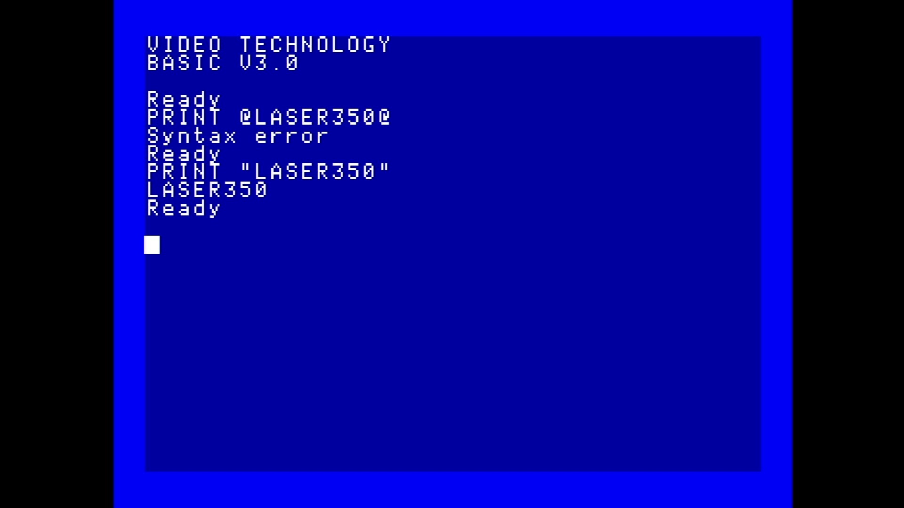

# Laser 350

- **`make kernel MACHINE=laser350`** — VTech
- **Year**: 1985
- **Manufacturer**: Video Technology

## At power-on

`Laser 350` at power-on on the real board — see the capture above.

## Required assets

- `roms/laser350.zip`

  | ROM | CRC32 |
  |---|---|
  | `27-0401-00-00.u6` | `9bed01f7` |
  | `27-393-00.u10` | `d47313a2` |

## Notes

- MAME driver: `vtech2.cpp`.

[← back to VTech](README.md)
