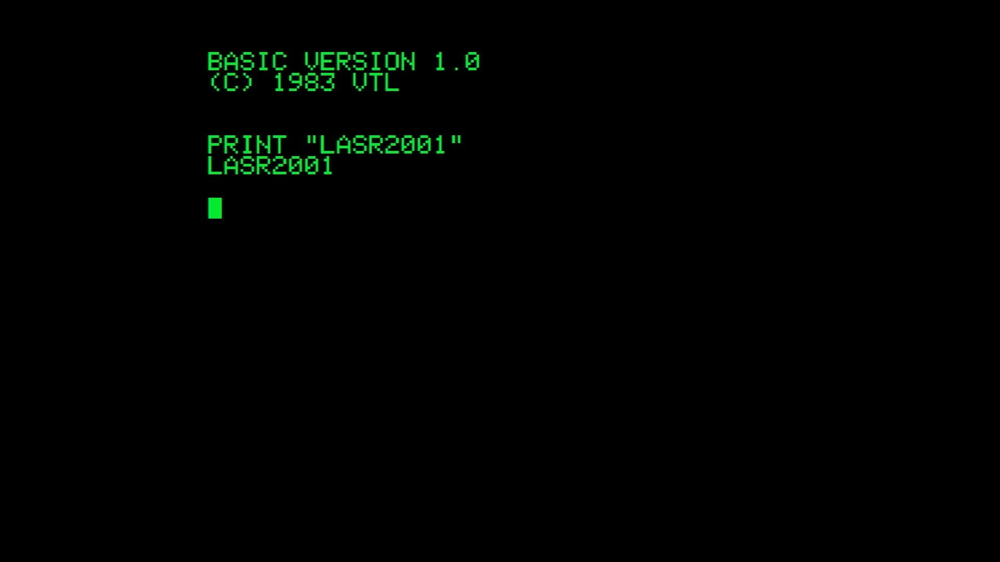

# Laser 2001

- **`make kernel MACHINE=lasr2001`** — VTech
- **Year**: 1983
- **Manufacturer**: Video Technology

## At power-on

`Laser 2001` at power-on on the real board — see the capture above.

## Required assets

- `roms/lasr2001.zip`

  | ROM | CRC32 |
  |---|---|
  | `laser2001.rom` | `4dc35c39` |

## Notes

- MAME driver: `crvision.cpp`.

[← back to VTech](README.md)
