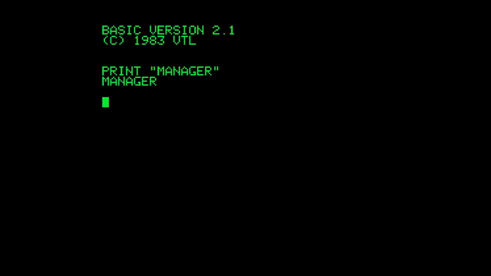

# Manager (Finland)

- **`make kernel MACHINE=manager`** — VTech
- **Year**: 1983
- **Manufacturer**: Salora

## At power-on

`Manager (Finland)` at power-on on the real board — see the capture above.

## Required assets

- `roms/manager.zip`

  | ROM | CRC32 |
  |---|---|
  | `01` | `702f4cf5` |
  | `23` | `46489d88` |

## Notes

- MAME driver: `crvision.cpp`.

[← back to VTech](README.md)
