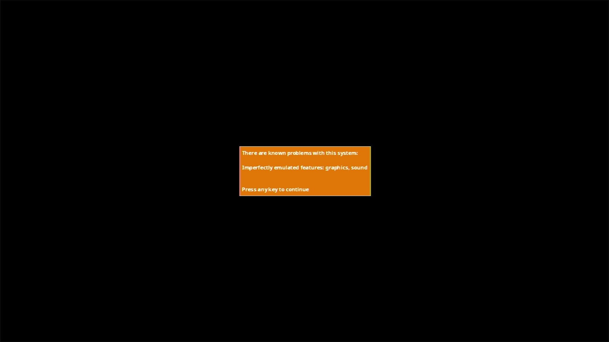

# V.Smile

- **`make kernel MACHINE=vsmile`** — VTech
- **Year**: 2005
- **Manufacturer**: VTech

## At power-on

**PARKED** — stops at MAME's known-problems box (imperfectly emulated graphics, sound). The capture above shows the observed stop; the machine is not offered until the park is lifted by a policy ruling.

## Required assets

- `roms/vsmile.zip`

  | ROM | CRC32 |
  |---|---|
  | `vsmile_v103.bin` | `387fbc24` |
  | `vsmile_v102.bin` | `0cd0bdf5` |
  | `vsmile_v100.bin` | `205c5296` |

## Notes

- MAME driver: `vsmile.cpp`.

[← back to VTech](README.md)
