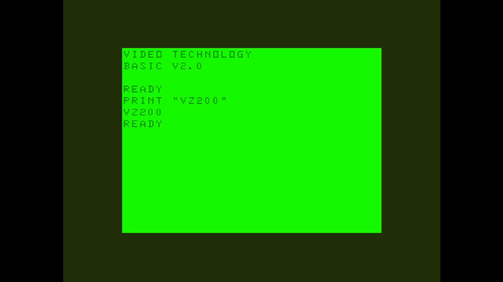

# VZ-200 (Oceania)

- **`make kernel MACHINE=vz200`** — VTech
- **Year**: 1984
- **Manufacturer**: Dick Smith Electronics

## At power-on

`VZ-200 (Oceania)` at power-on on the real board — see the capture above.

## Required assets

- `roms/vz200.zip`

  | ROM | CRC32 |
  |---|---|
  | `vtechv20.u09` | `cc854fe9` |
  | `vtechv20.u10` | `7060f91a` |
  | `vz200_v101.u9` | `70340b97` |

## Notes

- MAME driver: `vtech1.cpp`.
- MAME clone of `laser210` (Laser 210) — the system macro's parent field in the driver source. The ROM table above lists every member this machine's own zip needs.

[← back to VTech](README.md)
