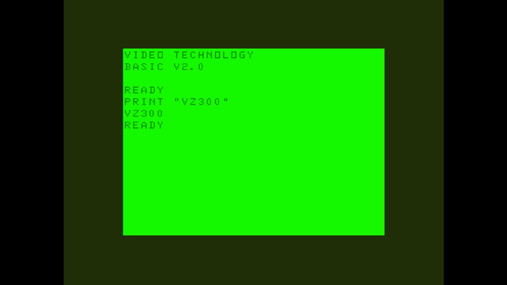

# VZ-300 (Oceania)

- **`make kernel MACHINE=vz300`** — VTech
- **Year**: 1984
- **Manufacturer**: Dick Smith Electronics

## At power-on

`VZ-300 (Oceania)` at power-on on the real board — see the capture above.

## Required assets

- `roms/vz300.zip`

  | ROM | CRC32 |
  |---|---|
  | `vtechv20.u12` | `613de12c` |
  | `vtechv21.u12` | `f7df980f` |

## Notes

- MAME driver: `vtech1.cpp`.
- MAME clone of `laser310` (Laser 310) — the system macro's parent field in the driver source. The ROM table above lists every member this machine's own zip needs.

[← back to VTech](README.md)
